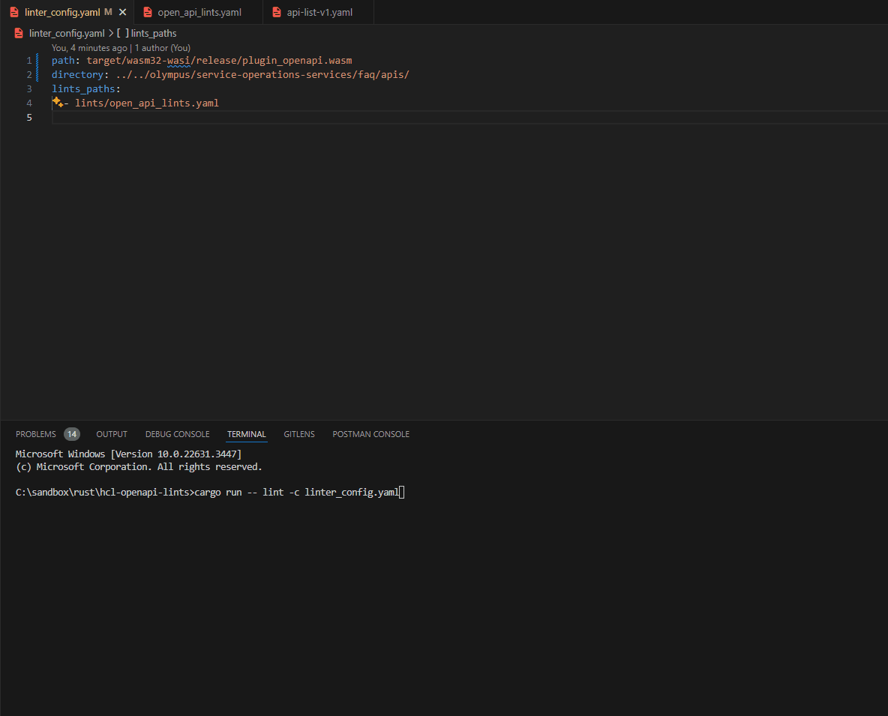

# Linter

A tool to lint OpenAPI and/or Terraform files and pickup any errors according to the rules specified

## Demo



## Usage

`linter -a [api yaml file or folder] -t [terraform folder] -c [config/lint file]`

`-a` is optional

## Query

Query uses GraphQL.

Typically, when you make a call to a database for data, you are expecting to receive data.
For the tool, it is more or less the opposite, you want to query to return data **if** it
is an error. For e.g. return any data where the tags are not set

### Available Helper Functions

  - filter - able to filter out the data
    - op - the operation name
    - value - (Optional) array of values to filter against
  - tag - apply a name to the given property field
    - name - (optional) name to apply
  - output - outputs the value
    - name - (Optional) The name to use when outputting
  - optional - optional field in query
  - recurse - recurse through x times on this edge
    - depth - The recursive depth
  - fold - apply a fold
  - transform - run a transformation operation on value
    - op - The operation to run

### Filters

- is_null
- is_not_null
- =
- !=
- <
- <=
- \>
- \>=
- contains
- not_contains
- one_of
- not_one_of
- has_prefix
- not_has_prefix
- has_suffix
- not_has_suffix
- has_substring
- not_has_substring
- regex
- not_regex

### Transform

 - count

## Lints

### Lint configs for a single plugin

Plugin config
```yaml
plugin:
  path: 'path/to/plugin'
  url: 'https://example.com/plugin.wasm' 
  # Either the path or the url variable should be set. Not both
  directory: 'path/to/files/to/be/linted' # This optional, will default to the current directory
lints:
  path:
    - 'path/to/folder/or/file/containing/lints'
    - 'path/to/other/folder/or/file/containing/lints'
    - url: 'https://example.com/lints.yaml'
    ...
  extra:
    - name: Lint name
      lint: |
        Some lint query
      error: The error message for the lint
    ...
```

Lint file(s)
```yaml
name: Lints related to x
description: Lints are related to the x feature # optional
lints:
  - name: Lint1
    lint: lint query
    error: lint1 error message
  - name: Lint1=2
    lint: lint query
    error: lint2 error message
  ...
```

## Plugins


Plugins generally, are loaded at runtime and uses either an embedded scripting language such as Lua or using dynamic libraries to execute the logic of that plugin. The ABI of Rust is currently not stable, so Rust dynamic libraries are not an option. A scripting language such as Lua can work but then you are stuck with just one tech stack which limits the amount of people who can or are willing to write plugins.

### Why WASM

Using WASM as a plugin system allows for many different languages to used in developing the plugin with the benefit of near native performance. WASM can also be used on any OS, meaning that the plugin only needs to be compiled once to WASM and not to many other architectures and OSes. It also allows for WASM libraries to be merged into one, meaning that the core logic can be written in Rust and link to expected functions of another WASM library that could be written in C or C# as an example.

The current WASM standard used is [WASI](https://wasi.dev/), which is an industry standard and allows for access to the filesystem, similar to how you can bind paths in Docker. This makes it easier for the plugin to choose what files to lint without having to write a complex host to filter files, directories etc. It also allows for the user to specify which directory the plugin has access to.

[WASIX](https://wasix.org/) is a superset of WASI which allows for multi-threading but it currently only supports Rust and C which limits the amount of languages used that can be used to develop plugins.

### List of Plugins

This is list of available plugins or to be developed:
- [ ] OpenAPI
  - [x] Initial implementation
  - [ ] Improve custom extensions
  - [ ] Document plugin
  - [ ] Example lints
- [ ] Terraform
- [ ] NPM package.json
- [ ] Flutter pubspec.yaml
- [ ] Cargo Toml
- [ ] Github Actions
- [ ] File-system

## Acknowledgements

 - [Trustfall](https://github.com/obi1kenobi/trustfall) which without, this project would not have been possible

## Contributions

Contributions are welcome.
